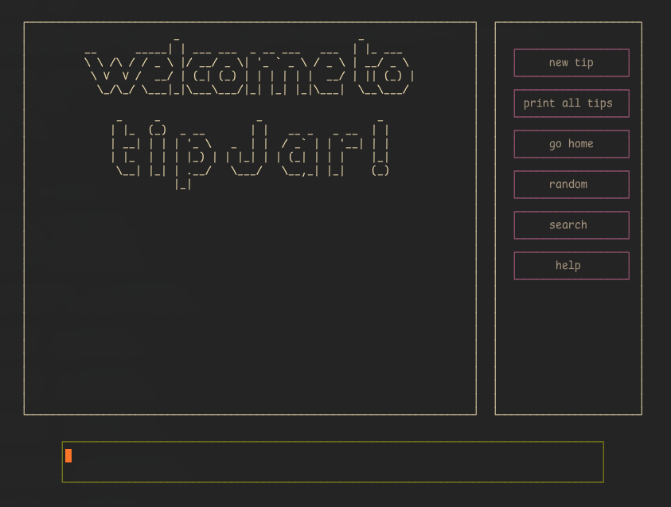

# welcome to tipJar!

you know those random bits of information you come across that you feel like you'll probably want at some point in the future but you have no idea where to put them?\
do you have a bunch of three line txt files cluttering your desktop with no way to search through them?

#### this is a place where you can store useful links, helpful life hacks, cool quotes, and random bits of information you have nowhere to put... a.k.a tips!
it runs directly in a terminal window so you can feel like a hacker even though you're probably not.


<br>

this was a project to 1. learn javascript and 2. build this tool. js was absolutely the wrong language for the job, i just forced it on this project as a way to learn the language.\
it's still buggy and unpolished. hopefully one day i'll rewrite this in a language it makes more sense to build a TUI in.
<br>
<br>

### how to run it
no way i'm publishing the javascript version of this so...\
clone the repo and run ```node src/controller.mjs``` to start the program.\
here are the dependencies you need
- [node](https://nodejs.org/en/download)
- [blessed](https://github.com/chjj/blessed)
- [figlet](http://www.figlet.org/)

<br>

blessed is the main dependency for this project. its last commit was in 2016, so if it randomly stops working it's not my fault!

<br>

### info about spacing

blessed works with terminal rows and columns for spacing. this means that if your terminal is too big or too small the spacing of buttons and boxes will be weird.\
this is a limitation of the blessed library and will be fixed in a rewrite in another language.\
for now just resize your terminal window and the spacing will dynamically update.
